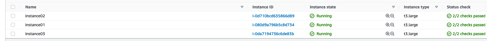

# ec2-existing-vpc-dynamodb-configuration

Python CDK project to demonstrate how you can dynamically deploy ec2 instances to an existing vpc based on configuration in dynamodb

### Deployment

#### Prerequisites

- [AWS Command Line Interface](https://aws.amazon.com/cli/)
- [AWS CDK](https://docs.aws.amazon.com/cdk/latest/guide/getting_started.html#getting_started_install)
- Python 3.9 or later
- [Poetry](https://python-poetry.org/docs/)
- A json file  with the following schema

``` json
"$schema": "http://json-schema.org/draft-04/schema#",
"type": "object",
"properties": {
  "instances": {
    "type": "array",
    "items": [{
        "type": "object",
        "properties": {
          "name": {
            "type": "string"
          },
          "class": {
            "type": "string"
          },
          "size": {
            "type": "string"
          },
          "key_name": {
            "type": "string"
          },
          "is_windows": {
            "type": "boolean"
          },
          "image_name": {
            "type": "string"
          }
        },
        "required": [
          "name",
          "class",
          "size",
          "key_name",
          "is_windows",
          "image_name"
        ]
      },
      {
        "type": "object",
        "properties": {
          "name": {
            "type": "string"
          },
          "class": {
            "type": "string"
          },
          "size": {
            "type": "string"
          },
          "key_name": {
            "type": "string"
          },
          "is_windows": {
            "type": "boolean"
          },
          "image_name": {
            "type": "string"
          },
          "user_data": {
            "type": "array",
            "items": [{
              "type": "string"
            }]
          }
        },
        "required": [
          "name",
          "class",
          "size",
          "key_name",
          "is_windows",
          "image_name",
          "user_data"
        ]
      },
      {
        "type": "object",
        "properties": {
          "name": {
            "type": "string"
          },
          "class": {
            "type": "string"
          },
          "size": {
            "type": "string"
          },
          "key_name": {
            "type": "string"
          },
          "is_windows": {
            "type": "boolean"
          },
          "image_name": {
            "type": "string"
          },
          "user_data": {
            "type": "array",
            "items": [{
              "type": "string"
            }]
          }
        },
        "required": [
          "name",
          "class",
          "size",
          "key_name",
          "is_windows",
          "image_name",
          "user_data"
        ]
      }
    ]
  }
},
"required": [
  "instances"
]
}
```
  - name - Unique key which serves as the name of the instance
  - class - Class of the instace based on [ec2.InstanceClass](https://docs.aws.amazon.com/cdk/api/v2/docs/aws-cdk-lib.aws_ec2.InstanceClass.html)
  - size - Size of the instance based on [ec2.InstanceSize](https://docs.aws.amazon.com/cdk/api/v2/docs/aws-cdk-lib.aws_ec2.InstanceClass.html)
  - key_name - the name of an existing ec2 keypair to associated with this instance 
  - is_windows - Whether the instance is windows otherwise linux
  - image_name - can be 'LATEST' or specific ami using the format 'region:ami-id' for example 'us-east-2:ami-096b151a05b7e8b5c'
  - user_data - String set of commands


To create a virtualenv on MacOS and Linux:

```
$ poetry install
```
Drop into the python virtual env
```
$ poetry shell
```


If you haven't already be sure to bootstrap your cdk environment
```
$ cdk bootstrap aws://$AWS_DEFAULT_ACCOUNT/$AWS_DEFAULT_REGION
```

At this point you can now deploy the solution by issuing the following command

```
$  cdk deploy -c DEFAULT_ACCOUNT=<THE DEFAULT AWS ACCOUNT TO DEPLOY TO IF NONE IS SPECIFIED> -c DEFAULT_REGION=<THE DEFAULT AWS REGION TO DEPLOY TO IF NONE IS SPECIFIED> -c DEV_ACCOUNT=<YOUR DEVELOPMENT ACCOUNT ID> -c VPC_ID=<A VPC ID TO DEPLOY TO> -c SECURITY_GROUP_ID=<A SECURITY GROUP TO ASSIGN TO THE INSTANCES> -c ROLE_ARN="<THE INSTANCE ROLE ARN TO ASSIGN TO THE INSTANCES>"

```
 The use of the context variables on the command line is not necessary you can (and probably should) define these values directly in the app.py along with different stacks for different environments

# Example

These values...


Result in this deployment


